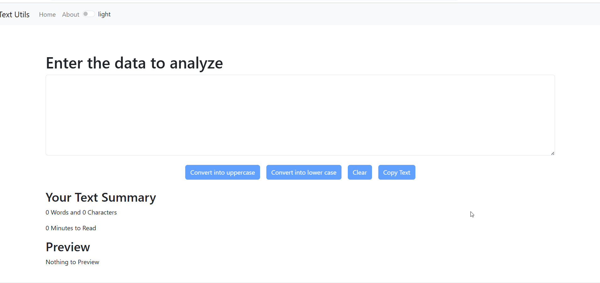

# 📝 Text Analyzer React App

A lightweight single-page React application that offers smart and interactive text manipulation tools. Built to practice core React concepts like routing, state management, props, conditional rendering, and live user feedback.

## ✨ Features

- 🔠 Convert text to **Uppercase** and **Lowercase**
- 📋 **Copy** text to clipboard
- 🧹 **Clear** entire text input
- 🔢 Count **Words**, **Characters**, and **Estimated Reading Time**
- 👁️ **Live Text Preview** area that updates with user input
- 🎯 Fully functional **SPA with React Router**
- 📡 Smooth **Loading Bar** on route change (UX enhancement)
- 📚 Second page includes a **Simple Accordion** with 4 collapsible sections

## 🔧 Tech Stack

- React.js
- React Router DOM
- HTML/CSS (custom styling, no UI framework)

## 🎥 Live Demo (GIF)

Here is a short demo of the app in action:

---

## 🧑‍💻 Developer

Developed by Asim Mir (asim249)
